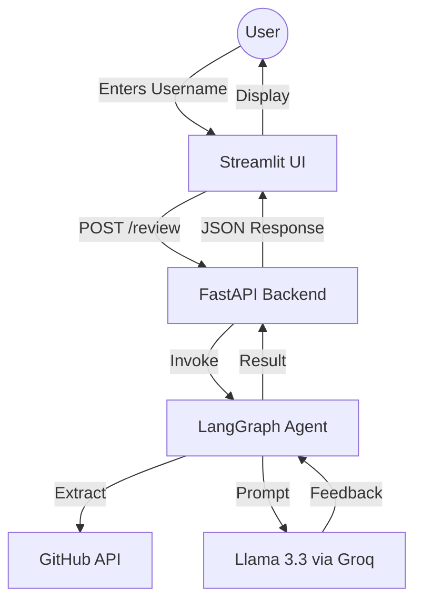

# 🐙 GitHub Code Mentor

Elevate your GitHub portfolio with AI-powered insights. This application uses **LangGraph** and **Llama 3.3** to analyze your repositories and provide actionable mentoring feedback.


## 🚀 Features

- **Automated Portfolio Analysis**: Extracts repository data, tech stats, and primary languages.
- **AI Mentorship**: Provides structured feedback on strengths and specific areas for improvement.
- **Modern Dashboard**: A premium Streamlit interface with interactive metrics and tabs.
- **Asynchronous Processing**: Uses FastAPI for reliable backend orchestration.

## 🛠️ Tech Stack

- **Frontend**: [Streamlit](https://streamlit.io/)
- **Backend**: [FastAPI](https://fastapi.tiangolo.com/)
- **AI Framework**: [LangGraph](https://www.langchain.com/langgraph) / [LangChain](https://www.langchain.com/)
- **LLM**: Llama 3.3 (via [Groq](https://groq.com/))
- **Language**: Python 3.x

## 🏗️ Architecture



## ⚙️ Setup & Installation

### 1. Clone the Repository
```bash
git clone <repository-url>
cd GenAI-Lab
```

### 2. Configure Environment Variables
Create a `.env` file in the root directory:
```env
GITHUB_TOKEN=your_github_token
GROQ_AI_API_KEY=your_groq_api_key
```

### 3. Install Dependencies
```bash
pip install -r requirements.txt
```

## 🏃 Running the Application

### Start the Backend
```bash
uvicorn main:app --reload
```

### Start the Frontend
```bash
streamlit run ui/app.py
```

## 📜 License
This project is licensed under the MIT License.
